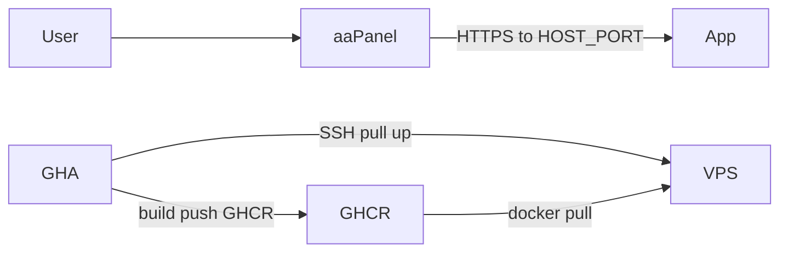

# Tallman Swiper VPS deployment runbook

Step-by-step production deploy on an **aaPanel** VPS using GHCR images, Docker Compose, and GitHub Actions.

**Production domain:** [https://swiper.tallmancode.co.za](https://swiper.tallmancode.co.za)

**Production shape:** aaPanel TLS → reverse proxy → Compose **app** (`HOST_PORT` from [`deploy/.env.example`](../deploy/.env.example)). One Node container serves the SPA and `/api/photos`. Images come from **GHCR**; the Deploy workflow SSHs in and runs `docker compose pull && up -d`.



UI labels match common aaPanel English installs. Paths like `/www/wwwroot/...` are aaPanel defaults on Linux.

Related: [README Docker and deploy](../README.md#docker-and-deploy).

---

## Part A — One-time aaPanel + VPS setup

### A1. DNS

1. At your DNS host for `tallmancode.co.za`, create an **A** record:
   - Name / host: `swiper` (→ `swiper.tallmancode.co.za`)
   - Value: your VPS public IP
2. Wait until it resolves before issuing Let’s Encrypt.

### A2. Firewall

Allow inbound **80** and **443** (and your SSH port). Do **not** expose the Compose host port publicly — [`docker-compose.yml`](../docker-compose.yml) binds to `127.0.0.1:<HOST_PORT>` so only the local reverse proxy can reach the app.

### A3. Install Docker

1. aaPanel **App Store** → install **Docker Manager**.
2. Confirm Compose:

```bash
docker version
docker compose version
```

Ensure `VPS_USER` can run Docker without interactive sudo (root, or member of the `docker` group). Membership in the `docker` group is effectively root-equivalent on the host — prefer a dedicated deploy account and rotate the SSH key used by Actions.


### A4. App directory

Prefer a dedicated Compose dir, e.g. `/www/dk_project/tallman-swiper`. That path is `VPS_COMPOSE_DIR`.

```bash
mkdir -p /www/dk_project/tallman-swiper
cd /www/dk_project/tallman-swiper
```

Copy from this repo:

- [`docker-compose.yml`](../docker-compose.yml)
- [`deploy/.env.example`](../deploy/.env.example) → **`.env`**

Actions never upload Compose or `.env`; only pull/up. When Compose layout changes, update `docker-compose.yml` on the VPS manually.

### A5. Fill production `.env`

| Variable | What to set |
| -------- | ----------- |
| `GHCR_OWNER` | GitHub user/org (lowercase; must match `ghcr.io/<owner>/tallman-swiper`) |
| `IMAGE_TAG` | First release tag, e.g. `v0.1.0` (Deploy overwrites via SSH env) |
| `HOST_PORT` | Free host port aaPanel proxies to |
| `PORT` | Keep `3000` (container listen port / healthcheck) |
| `PEXELS_API_KEY` | Production Pexels API key (never commit) |

### A6. Log in to GHCR on the VPS

Create a GitHub PAT with **`read:packages`**. On the VPS as `VPS_USER`:

```bash
echo YOUR_PAT | docker login ghcr.io -u YOUR_GITHUB_USERNAME --password-stdin
```

### A7. Website + reverse proxy + SSL

1. aaPanel **Website** → Add site for `swiper.tallmancode.co.za` (pure static / no PHP).
2. **Reverse proxy** → target `http://127.0.0.1:<HOST_PORT>` (match `.env`).
3. **SSL** → Let’s Encrypt → Force HTTPS.

### A8. Sanity checks

```bash
cd /www/dk_project/tallman-swiper   # your VPS_COMPOSE_DIR
docker compose ps
# Replace HOST_PORT with the value from your .env
curl -sS -o /dev/null -w "%{http_code}\n" http://127.0.0.1:HOST_PORT/
curl -sS http://127.0.0.1:HOST_PORT/health
curl -sS -o /dev/null -w "%{http_code}\n" http://127.0.0.1:HOST_PORT/api/photos
```

### A9. Optional local Compose smoke

```powershell
# copy deploy/.env.example → .env beside docker-compose.yml
docker compose up --build
```

Open `http://localhost:<HOST_PORT>`.

---

## Part B — One-time GitHub setup

### B1. Branches

Promotion expects:

- `develop` — day-to-day work
- `staging` — quality gate (create once from `develop` if missing)
- `main` — production releases

```bash
git fetch origin
git push origin origin/develop:refs/heads/staging
```

Set the repo default branch to **`main`**. Leave `master` unused.

### B2. Environments

**Settings → Environments**. Create:

- `staging` — Promote to staging
- `production-promote` — Promote to main
- `production` — Cut release + Deploy

Add **required reviewers** on `staging`, `production-promote`, and `production`. Without reviewers, anyone who can run workflows can promote code to production.

### B3. Secrets on environment `production`

| Secret | Required | Notes |
| ------ | -------- | ----- |
| `VPS_HOST` | Yes | VPS IP or hostname |
| `VPS_USER` | Yes | SSH user that can run Docker |
| `VPS_SSH_KEY` | Yes | Private key PEM |
| `VPS_PORT` | No | Defaults to `22` |
| `VPS_COMPOSE_DIR` | Yes | Absolute path to Compose dir |
| `VITE_SENTRY_DSN` | No | Baked into the SPA at image build time |

`PEXELS_API_KEY` lives on the VPS `.env`, not in GitHub Actions.

---

## Part C — Release flow

```text
develop → promote staging → promote main → cut release tag vX.Y.Z → deploy
```

1. **Promote to staging** — ff-only `staging` ← `develop` if tip SHA has green CI.
2. **Promote to main** — ff-only `main` ← `staging`.
3. **Cut release** — annotated tag `vX.Y.Z` + GitHub Release. Pushing the tag triggers Deploy.
4. **Deploy** — build/push `ghcr.io/<owner>/tallman-swiper:<tag>` → SSH `docker compose pull && up -d`.


`staging` is a quality gate only (no staging VPS).

---

## Troubleshooting

| Symptom | Check |
| ------- | ----- |
| Deploy SSH fails | `VPS_*` secrets, key user, `VPS_COMPOSE_DIR` exists |
| `docker compose pull` auth error | `docker login ghcr.io` on VPS; package visibility |
| Healthcheck failing | `docker compose logs app`; `PEXELS_API_KEY` set; `PORT=3000` |
| 502 from aaPanel | Containers up? Proxy target matches `HOST_PORT`? |
| `/api/photos` 500 | Missing or invalid `PEXELS_API_KEY` in VPS `.env` |
